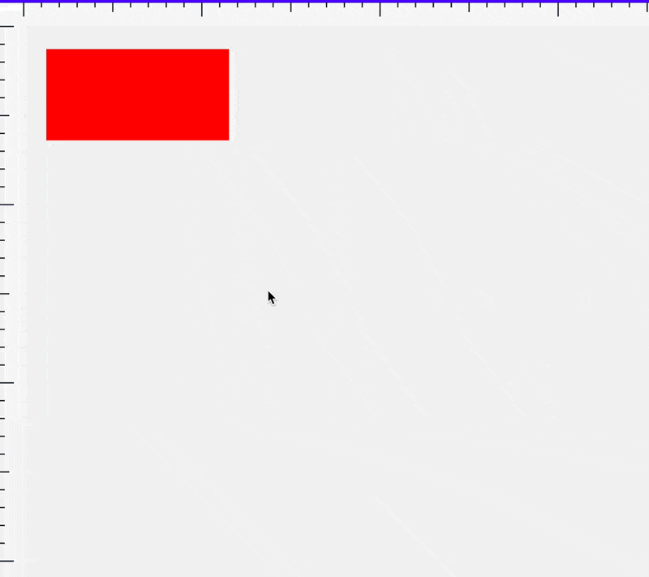
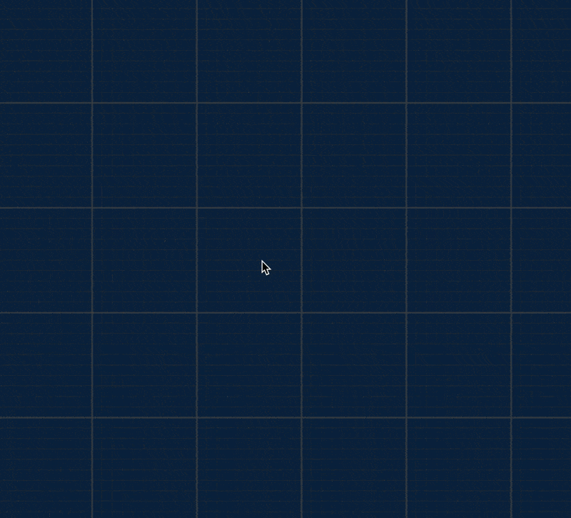

# Number Line
A dependency less, typescript based, flexible and functional number line. Stretch it, zoom it, shift it and use it to find values.

## What it is
If you have ever used a graphic program like Photoshop or Sketch, you would have noticed horizontal and vertical number lines sticking in the top and left sides of the canvas. These number lines serve to guide you with various measurement critical tasks specific to these programs.

_Number Lines js_ aims to be a nifty feature rich utility for anyone looking for building this pesky detail.

## 2D Axis by iterating over the view model



## CSS based grid using number line for all the pattern values



## Features

* Virtually infinite number line
* Custom Unit tick mark patterns
* Strategy pattern for tick labels
* Stretch to fit
* Range to fit
* Move/displace with respect to the origin
* Adaptive zooming around a defined fixed value (__Very Important__)
* Unit length gets stretched within range based on number line magnification
* Get value at length
* Get length for value
* ViewModel for rendering purposes(more on that later)

Besides this, the library, is well tested, well documented, pure vanilla typescript code with no external dependencies.All operations in the main class execute in O(1) time. Building the view model takes O(n) time.

## But wait, where is the rendering code?

There exists a **sample** vanilla html renderer code in ```html-renderer.ts```. Its pure typescript and has no dependency on any third party CSS libraries or frontend framework. But that code is merely a sample of how to implement a renderer. You are more than encouraged to **copy, modify or use or own renderer**.

This utility is designed to be a **number crunching system**. It doesn't do any rendering itself. Instead it gives you an idea as to what the number line looks like. In Software Engineering, a ViewModel is a term used to describe how a view should be drawn. 

Drawing the number line itself is not a very hard task if you have all the information. The NumberLine class exposes a method that outputs a ```NumberLineViewModel``` class in linear time that can be used to draw the number line using any format or technology. You can **use HTML, SVG or your favorite Canvas library**.

The construction of NumberLineViewModel will invoke your ITickMarkLabelStrategy to label the ticks as per your formatting needs. NumberLineViewModel will also tell you how tall each tick mark is, its associated tick label and gapping between tick marks. All this informaiton is computed from the tickMarkPattern array that you supply as part of the initialization process.

__TLDR__ For every change, you output the NumberLineViewModel object and use that to linearly render the number line.

## What can I use it for

Here are a few use cases that I can think of:

 * Graphic applications
 * Measurement apps
 * Visualizing scale in maps
 * Interactive Data visualizations
 * Graph calculators(like desmos)
 * Animation curve editor(this is what I am using it for)
 * 3D modellers
 * Finance apps

Keep in mind, the number line only describes 1 axis, so every axis needs its own dedicated number line. For example: a _three js_ 3d modelling application will require 3 NumberLine objects.

Making a simple number line is not hard but I think making a customizable and interactive number line is tricky and I hope this library saves some precious hours for another soul.

## Getting Started

### Important Note
Currently this library is undergoing some massive changes.It will be ready soon. The following is a developer preview but the latest updates haven'
t been published on NPM.

```
npm install number-line
```

```
import { NumberLine, NumberLineViewModel } from 'number-line';
import { render } from "number-line/html-renderer";

const labelStrategy:ITickMarkLabelStrategy={
	labelFor:(value,index,position, numberLine)=>{
		if(index%5==0){
			// return value in string to just on precision on floating point
			return value.toFixed(0);
		}
		return null;
	}
	
}
const numberLineOptions:INumberLineOptions={
	pattern:[3,1,1,1,1,2,1,1,1,1],
	breakpointLowerbound:100,
	breakpointUpperBound:150,
	labelStrategy:labelStrategy
}


const myNumberLine = new NumberLine(numberLineOptions);
const myDiv = document.querySelector("#my-element") as HTMLElement;
render(myNumberLine,myDiv);
```

## Known limitations

 1. Uneven gaps between tick marks is not supported
 2. Building the view model requires the length of number line upfront. This means you have to calculate the length of the container in which you are drawing. As a fix you can consider drawing a long enough number line and then clipping it.
 3. Eventhough, clipping the number line is most likely going to be your desired behaviour, the ViewModel itself is not responsive. So to create a responsive number line, you will have to listen resize changes(on either [window](https://developer.mozilla.org/en-US/docs/Web/API/Window/resize_event) or an [element using ResizeObserver](https://developer.mozilla.org/en-US/docs/Web/API/ResizeObserver)) and use stretchToFit (or rangeFit) to calculate appropriate magnification and limits

## FAQ

### Can I go beyond the limits defined by the ViewModel

Yes the view model contains all the information needed to render the current status. Since the number line follows a designated pattern, you can decipher a simple algorithm to go beyond the limits.

### How do I draw it on a canvas?

There are several tutorials on how to draw a simple number line. Go through those first. Then you will get a gist of how to use the view model.

### Can I use Angular,Vue,Svelte,React etc?

Yes. I am personally using it with Angular. I wanted the number line to be fully compatible with the templating engine because of all the HTML goodies that come with it. 

### But my number line needs to have XYZ features in it

In software engineering, _composition_ is the art of wrapping an idea in a bigger idea and building on top of it. Food for thought!

### How can I create a pure CSS driven grid lines that is responsive to all the zooming and panning from the number lines?

This requires creating 2 number lines. One for x axis and the other for y axis. You then create a div container background with the following CSS properties: 

``` scss
$major-grid-line-color:rgba(70, 70, 70,0.2);
$minor-grid-line-color:rgb(45, 45, 45,0.2);

.grid-lines-container{
	margin:0;
    background-color: #0a203a;
    background-image: linear-gradient($major-grid-line-color 2px, transparent 2px), linear-gradient(90deg, $major-grid-line-color 2px, transparent 2px), linear-gradient($minor-grid-line-color 1px, transparent 1px), linear-gradient(90deg, $minor-grid-line-color 1px, transparent 1px);
    background-repeat: repeat;
    width: 100%;
    height: 100%;
	box-sizing:border-box;
}
```

There is a lot going on in the above code, but the main property is the __background-image__ property along with __background-repeat__. The combination of these 2 properties creates a repeating pattern on the container where each cell is controlable. 

To control the pan of the grid procedurally, we set the following style on the container:

```javascript
container.style.background-position-x.px="panX"
container.style.background-position-y.px="panY"
```
where panX and panY are obtained from the number line

To control the size of each cell (as a result of zooming) we use the following properties on the container:
```javascript

container.style.background-size="backgroundSizeStyleCover"
```
where ```backgroundSizeStyleCover``` is a result of each number line's cell size and can be obtained by:

```typescript
get backgroundSizeStyleCover():string{
		const cell = xAxis.unitLength;
		const subCell = (cell / 10);// in our case, we chose to divide each unit into 10 steps

		// the following is the background-size syntax that can be set in conjunction with background-image
		return `${cell}px ${cell}px, ${cell}px ${cell}px, ${subCell}px ${subCell}px, ${subCell}px ${subCell}px`;
	}
```

Note that in the above case we are assuming that both x and y axis zoom at the same rate and have the same scale(which is why we are using the x axis along. If your grid is uneven, you will want to adjust accordingly ensuring the cell size is approriate for that axis)